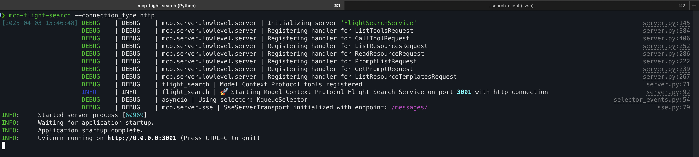

# MCP Flight Search Client


A client application for the MCP Flight Search service. This client interacts with the [MCP Flight Search](https://github.com/arjunprabhulal/mcp-flight-search) backend.

## Description

This client application provides a user-friendly interface to interact with the Model Context Protocol (MCP) flight search service. It allows users to search for flights between airports with specified dates.

## Files

- `mcp_flight_client.py`: Main client implementation for interacting with the MCP Flight Search service
- `prompt_templates.py`: Contains prompt templates for generating flight search queries

## Installation

Install the required packages for this client:

```
pip install -r requirements.txt
```

Required packages:
- llama-index
- llama-index-llms-ollama
- llama-index-tools-mcp
- langchain-community

### Installing Ollama

This client uses Ollama to run Llama 3.2 locally. To install Ollama:

1. Download Ollama from the [official website](https://ollama.com/download)
2. Install and start the Ollama application
3. Pull the Llama 3.2 model:
```
ollama pull llama3.2
```

## Prerequisites

You need to have the [MCP Flight Search](https://github.com/arjunprabhulal/mcp-flight-search) service running.

### Installing the MCP Flight Search Package

```
# Install from PyPI
pip install mcp-flight-search
```

### Starting the MCP Server

You can start the MCP server using one of the following methods:



```
# Using the command-line entry point
mcp-flight-search --connection_type http

# Or using the Python module approach
python -m mcp_flight_search.server --connection_type http
```

## Usage

```
python mcp_flight_client.py
```

## Architecture

```ascii
+------------------------------+      HTTP      +------------------------------+
|                              | <------------> |                              |
|  MCP Flight Search Client    |                |  MCP Flight Search Server    |
|  (This Repository)           |                |  (Backend Service)           |
|                              |                |                              |
|  - mcp_flight_client.py      |                |  - search_flights_tool       |
|  - prompt_templates.py       |                |  - server_status             |
|                              |                |                              |
|  Uses:                       |                |  Uses:                       |
|  - llama-index               |                |  - Model Context Protocol    |
|  - llama-index-llms-ollama   |                |  - SerpAPI for Google       |
|    (with Llama 3.2)          |                |    Flights data             |
|  - llama-index-tools-mcp     |                |                              |
|  - langchain-community       |                |                              |
+------------------------------+                +------------------------------+
              |                                               |
              |                                               |
              v                                               v
+------------------------------+                +------------------------------+
|                              |                |                              |
|  Ollama (Local LLM)          |                |  Flight Search               |
|  Running Llama 3.2           |                |  APIs                        |
|                              |                |                              |
+------------------------------+                +------------------------------+
              |
              |
              v
+------------------------------+
|                              |
|  User Interface              |
|                              |
+------------------------------+
```

This architecture shows how the MCP Flight Search Client connects to the MCP Flight Search Server over HTTP. The client uses various libraries to interact with the server, which in turn uses the Model Context Protocol (MCP) to provide flight search functionality through tools like `search_flights_tool`.

The client leverages Ollama to run Llama 3.2 locally, providing powerful language model capabilities while maintaining privacy and reducing dependency on cloud services.

## Author

For more articles on AI/ML and Generative AI, follow me on Medium: [https://medium.com/@arjun-prabhulal](https://medium.com/@arjun-prabhulal)

## License

This project is licensed under the MIT License 